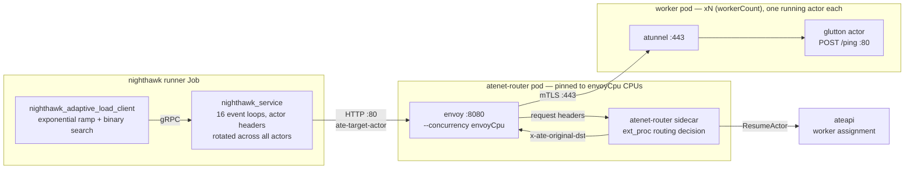
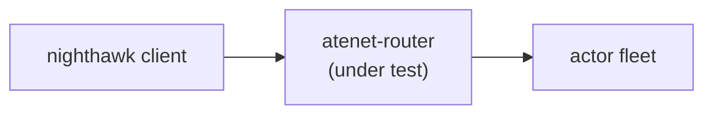

# Nighthawk ingress-capacity benchmark

## Objective

Measure the scale and performance of substrate's networking
infrastructure. This benchmark covers the ingress routing path
(`atenet-router --mode=ingress`); egress will be a separate benchmark.

The concrete measurement, per Envoy CPU configuration:

> **What is the maximum request rate the ingress path sustains while
> tail latency stays under the SLO?\***

The benchmark finds that number automatically using
[Nighthawk](https://github.com/envoyproxy/nighthawk) (Envoy's benchmarking
client) in
[adaptive mode](https://github.com/envoyproxy/nighthawk/blob/main/docs/root/adaptive_load_controller.md):
it ramps open-loop load until a threshold breaks, binary-searches the
boundary, and confirms with a longer run. Run
it across `envoyCpu` configs to get a capacity-per-core curve, or
continuously in CI to catch routing-path performance regressions.

\* *The SLO bounds latency **mean+2σ**, not a true percentile: Nighthawk's
adaptive search can only gate on its
[built-in metrics](https://github.com/envoyproxy/nighthawk/blob/main/docs/root/adaptive_load_controller.md#available-metric-plugins)
(success-rate, send-rate, rps, latency mean/stdev). mean+2σ ≈ p95–p97 for
bell-shaped latency; true p50/p95/p99 are still reported per stage, they
just don't steer the search.*

## What it measures

Every request exercises the **full production routing path** — created and
warmed sandboxed actors, actor-reference header routing, the ext_proc routing
decision, and the mTLS hop to the worker:



Client-measured latency therefore covers: network to Envoy, Envoy
processing, the routing decision in the ext_proc sidecar (including its
ateapi lookup), the mTLS hop, and the actor's handler.

**"Capacity" means all three of the following hold at once** — each threshold
catches a failure mode the others can't see:

| Threshold (tests.yaml knob) | Guards against | Typical symptom at the limit |
|---|---|---|
| `tailLatencySloMs` — latency mean+2σ ≤ X ms (~p95 proxy, see [Objective](#objective)) | the router getting *slow* | queues build inside Envoy/router, tail latency climbs past the SLO |
| `successRateThreshold` (0.999) | the router getting *fast but wrong* | 503s from parking overflow, 504 route timeouts |
| `sendRateThreshold` (0.9) | the *client* being unable to deliver the load | paced requests skipped once latency × RPS exceeds the connection pools |

## How it works

One Kubernetes Job per `type: nighthawk-ingress` tests.yaml entry, driven by
[`../automation/orchestrator.py`](../automation/orchestrator.py):

1. **Pin the router.** The orchestrator patches the `atenet-router`
   Deployment: both containers get cpu `requests=limits=envoyCpu`
   (Guaranteed QoS), Envoy gets `--concurrency envoyCpu`, and the debug
   log flags are dropped. Waits for rollout; every test tears substrate
   down afterwards, so nothing leaks.
2. **Create + warm actors.** The runner creates one glutton actor per
   WorkerPool worker (the entry's `workerCount`) via ateapi and POSTs
   `/ping` through the router with each actor's routing header until it
   answers 200.
3. **Adaptive search.** Open-loop traffic with the actor routing header rotated
   across all actors; `clientConcurrency` event loops (default 16,
   decoupled from `envoyCpu`) and large per-loop pools so the harness is
   never the bottleneck. Exponential ramp → binary search → a 60s
   **testing stage** at the converged rate.
4. **Upload results** (see below). The Job exits 0 only if the session
   converged and all artifacts uploaded.

## How to run it

### In CI

Add a `type: nighthawk-ingress` entry to the tests file the orchestrator
runs (`--tests`), e.g.:

```yaml
- name: ingress_routercap_envoy_2cpu
  type: nighthawk-ingress
  targetCluster: dev
  duration: 30m          # job-wait budget only
  workerCount: 50        # also the actor fleet size: one warm actor per worker
  nighthawk-ingress:
    envoyCpu: 2
    tailLatencySloMs: 25
```

### On a dev cluster

One-time prerequisites: a cluster from the GKE Quickstart in the repo
README, with nodes big enough for the two large pods (the router pod
requests 2×`envoyCpu` CPUs; the runner requests `clientConcurrency`+1).

```bash
# .ate-dev-env.sh at the repo root, then:
hack/install-ate.sh --deploy-ate-system
benchmarking/workloads/deploy.sh --deploy --worker-count 50 --sandbox-class gvisor
```

Then each benchmark run is one command, ~8–10 min:

```bash
./benchmarking/nighthawk-ingress/run-dev.sh --envoy-cpu 2
```

[`run-dev.sh`](run-dev.sh) runs only the benchmark layer. One invocation:

1. Verifies the prerequisites above, printing the fix for anything missing.
2. Pins the router if its current cpu differs from `--envoy-cpu`, so CPU
   sweeps need no redeploy.
3. Builds the runner image **from your working tree** — uncommitted changes
   included, and such runs are tagged `-dirty`.
4. Submits the Job, streams its logs, and prints the resulting
   `capacity.json`.

Flags: `--envoy-cpu`, `--actors`, `--tail-latency-slo-ms`, `--atespace`,
`--dest`, `--sample-resources` (see
`--help`). It needs a running Docker daemon and gcloud/kubectl credentials.

Notes:

- The script does not redeploy substrate — if substrate code changed,
  rerun `hack/install-ate.sh --deploy-ate-system` first.
- `--atespace` isolates actor *fleets* between experiments sharing a
  cluster; capacity runs themselves still need the router exclusively
  (the cpu pin is global and the run saturates it).
- The full clone + deploy/teardown-per-test cycle is the orchestrator's
  job and runs in CI — see "In CI" above.

### Reading the results

Artifacts land under
`<dest>/runs/<name>/run_date=.../run_ts=.../run_tag=<commit>/`.
Start with `capacity.json`, drill into `stats.jsonl`:

| file | contents |
|---|---|
| `capacity.json` | **the verdict**: `slo_max_rps` — the highest rate that passed every threshold (the number to track), `binding_threshold` — which limit defined it, plus the testing stage's metrics and p50/p95/p99 |
| `stats.jsonl` | one record per stage: Nighthawk's builtin metrics under `metric_nighthawk.builtin_*` keys (note: `achieved_rps` counts requests *sent*, errors included), status counts, latency percentiles, and the stage's `failed_thresholds` |
| `results.json` | full session, 1:1 with Nighthawk's output |
| `spec.textproto`, `output.textproto` | exact Nighthawk input/output, for reproducibility |
| `status.json`, `logs.txt` | run metadata + process logs |
| `resources.jsonl`, `resources-by-stage.json`, `envoy-stats.jsonl` | only with `--sample-resources`; see "Resource usage" below |

## Resource usage

Three tools put CPU and memory next to `stats.jsonl`. All three write the
`stats.jsonl` envelope (`timestamp`, `tag`, `test_name`, `metric`,
`measurements`) and need only the Python standard library. Their tests are
`unittest` cases: `python3 -m unittest discover -s tests` runs them, but
silently skips the directory's older pytest-style `test_output.py` and
`test_spec.py`. `python3 -m pytest tests` runs all of them.

A sample covers the window `(timestamp - window_s, timestamp]` and counts
toward every stage that window overlaps. `resources-by-stage.json` gives
mean, max, p95 and `n` per stage and container. For router containers
it adds `cpu_fraction_of_pin`, which is `cpu_cores / --envoy-cpu`.

`null` means no sample reached that stage and container. A missing source
reads as `null`, never as zero. `missing` lists containers that produced
no sample at all.

### During a run: `resource_sampler.py` and `--sample-resources`

This is the only source of router CPU and memory on the benchmark
cluster today. `runner.py --sample-resources [--sample-interval 2]` polls
each relevant node's kubelet cAdvisor endpoint through the API server,
`/api/v1/nodes/<node>/proxy/metrics/cadvisor`, and writes
`resources.jsonl` and `resources-by-stage.json` to the work dir, which
the upload step copies next to `stats.jsonl`. It samples:

- router: `ate-system`, `app=atenet-router`, containers `envoy` and
  `atenet-router`;
- runner: `benchmarking`, `app=substrate-benchmark-runner`, container
  `runner`, narrowed to the runner's own pod via `HOSTNAME`;
- workers: `benchmark-workloads`, `ate.dev/worker-pool`, container `ateom`.

Per container it records `cpu_cores`, the rate of
`cpu_usage_seconds_total` between two cAdvisor readings,
`cfs_throttled_ratio`, `working_set_bytes` and `rss_bytes`. Each target
pod also gets a `POD` row with pod network and PSI. The flag is off by
default. Standalone, with the caller's kubeconfig:

```
python3 resource_sampler.py --duration 60 --interval 2 --out /tmp/rs \
  [--stats stats.jsonl] [--envoy-cpu 2] [--context <ctx>] \
  [--target component=namespace:selector[:c1,c2]]
```

The runner's ServiceAccount needs `nodes/proxy` get cluster-wide and
`pods` list in `ate-system`, `benchmarking` and `benchmark-workloads`.
`resource-sampler-rbac.yaml` grants both; apply it after those namespaces
exist. The orchestrator does not apply it. `nodes/proxy` reaches every
kubelet endpoint, including exec, so grant it only on
benchmark clusters.

Limits:

- The sampler keeps the series `benchmarking/monitoring.yaml` keeps. Like
  that config, it drops `cpu_usage_seconds_total` and
  `memory_working_set_bytes` on the pod cgroup row, `container=""`. That
  row is the sum of the containers, and keeping both double counts.
- cAdvisor refreshes each container every 10 to 20 s, whatever the poll
  interval. A poll that finds no new reading writes no value for it, and
  a rate's `window_s` is the real gap between cAdvisor readings. Expect
  roughly one CPU point per 10 s stage.
- CFS throttling appears only for containers with a CPU limit. A
  BestEffort router has no `cfs_throttled_ratio`.
- Actors run inside the worker's `ateom` container, so a worker row
  covers every actor on that worker.

### After a run: `fetch_run_resources.py`

```
SSL_CERT_FILE=/etc/ssl/cert.pem python3 fetch_run_resources.py \
  gs://<bucket>/runs/<name>/run_date=.../run_ts=.../run_tag=<sha> \
  --project <project> --cluster <cluster> --envoy-cpu 2 --out /tmp/res
```

`--project` and `--cluster` default to `PROJECT_ID` and `CLUSTER_NAME`
from the environment, so `source .ate-dev-env.sh` covers both. The
tool reads `stats.jsonl` and queries Managed Prometheus for the run's
time range. By default it fetches what the benchmark cluster exports today:

- `ate.actor.stats.*` from the run's atelet pods, matched by the commit
  sha in the tag or named with `--atelet`: actor CPU,
  working set and sampled actor count, summed per atelet pod;
- router request rate from `atenet.router.route.duration`, for the
  `atenet-router-*` pod on the same nodes as those atelet pods.

Two Substrate installs can report under one cluster label, so the tool
picks the run's pods by name, never by cluster alone. `--system-metrics`
adds `kubernetes.io/container/*` queries for router, runner and worker
containers. They return nothing until the cluster exports GKE system
metrics.
`queries` in `resources-by-stage.json` records every query with its
series count or error.

The caller needs `roles/monitoring.viewer` on the project and
`storage.objects.get` on the bucket. The token comes from `--token-file`,
`GOOGLE_OAUTH_ACCESS_TOKEN`, or
`gcloud auth application-default print-access-token`. The python.org
build of Python ships no CA bundle, hence `SSL_CERT_FILE`.

Limits:

- Points are 60 s rates, and stages last about 10 s. One point spans
  several stages, so per-stage values are smeared and `n` is often 1
  or 2.
- Monitoring keeps data for six weeks.
- Actor stats are per atelet pod, the sum of the actors it hosts, not
  per actor.

### Envoy admin stats: `envoy_stats.py`

With `--sample-resources`, the runner also snapshots the router's Envoy
`/stats` before and after the session into `envoy-stats.jsonl`. It keeps
`server.memory_*`, `server.worker_*`, `cluster.*.upstream_cx_total`,
`http.*.downstream_rq_*` and `listener.*.downstream_cx_*`. Subtract
`before` from `after` for session counters.

```
python3 envoy_stats.py --via proxy --label now --out envoy-stats.jsonl [--context <ctx>]
```

The admin port is 9901 on the pod IP. The `atenet-router` Service does
not expose it, so a Service address cannot reach it.

- `--via direct` is the runner default. It reads pod IPs from the
  `atenet-router` EndpointSlices, which Role `atelet-endpointslices`
  already grants the runner. It then GETs `http://<pod IP>:9901/stats`.
  The runner Job runs in the benchmark cluster, so this needs no new
  RBAC. It works only while no NetworkPolicy blocks `ate-system` ingress.
- `--via proxy` goes through the API server:
  `/api/v1/namespaces/ate-system/pods/<pod>:9901/proxy/stats`. It needs
  `pods` list and `pods/proxy` get in `ate-system` and works off-cluster.

A Prow job runs outside the benchmark cluster and cannot reach pod IPs.
It would need `--via proxy` with those two permissions for its
credentials, or a `9901` port on a Service it can reach.

`stats` is `null`, with `error` set, when a pod's admin port did not
answer.

## Tuning

### Configuration knobs (the `nighthawk-ingress:` block)

The fleet size is the entry's top-level `workerCount` (required): the
benchmark warms one actor per worker, so it is also the number of glutton
actors receiving rotated actor-reference header traffic. Everything else lives in the
`nighthawk-ingress:` block:

| Knob | Default | Meaning |
|---|---|---|
| `envoyCpu` | required | cpu `requests=limits` on both router containers, and Envoy's `--concurrency`. The benchmark's independent variable. |
| `atespace` | `ingress-benchmark` | Actor namespace; name it per *experiment*, never per run (atespaces are never auto-deleted). |
| `tailLatencySloMs` | 0 (disabled) | The SLO: upper bound on latency mean+2σ (~p95 proxy), in ms. |
| `successRateThreshold` | 0.999 | Minimum 2xx fraction of sent requests. |
| `sendRateThreshold` | 0.9 | Minimum sent fraction of the paced schedule (open-loop backstop). |
| `clientConcurrency` | 16 | Nighthawk event loops; the runner Job requests `clientConcurrency+1` CPUs. Deliberately decoupled from `envoyCpu`. |
| `connections` | 1000 | Client connections per event loop. |
| `maxPendingRequests` | 10000 | Client-side queue per event loop. |
| `initialRps` | 500 | Total starting RPS of the exponential ramp. |
| `exponentialFactor` | 2.0 | Ramp multiplier per step; smaller = tighter bracket around the knee, more steps. |
| `measuringPeriod` | 10s | Length of each adjusting step. |
| `convergenceDeadline` | 600s | The session errors if the search hasn't converged by then. |
| `testingStageDuration` | 60s | Final confirmation run at the converged rate. |

### Sizing the rig: hit the router's ceiling, not the harness's

Three components sit in series; the reported capacity is whichever
saturates first. The sizing knobs exist to make that the router:



**One rule:** client and fleet must each handle ~2× the capacity you
expect to measure — the ramp overshoots before converging, and the rig
must survive the overshoot stages, not just the converged rate. A failed
stage's row in `stats.jsonl` tells you who saturated:

- `send_rate` below threshold — the client; raise `clientConcurrency`.
- 502s — the actor fleet; raise `workerCount`.
- latency climbing smoothly into the SLO — the router itself; that is
  the measurement.


