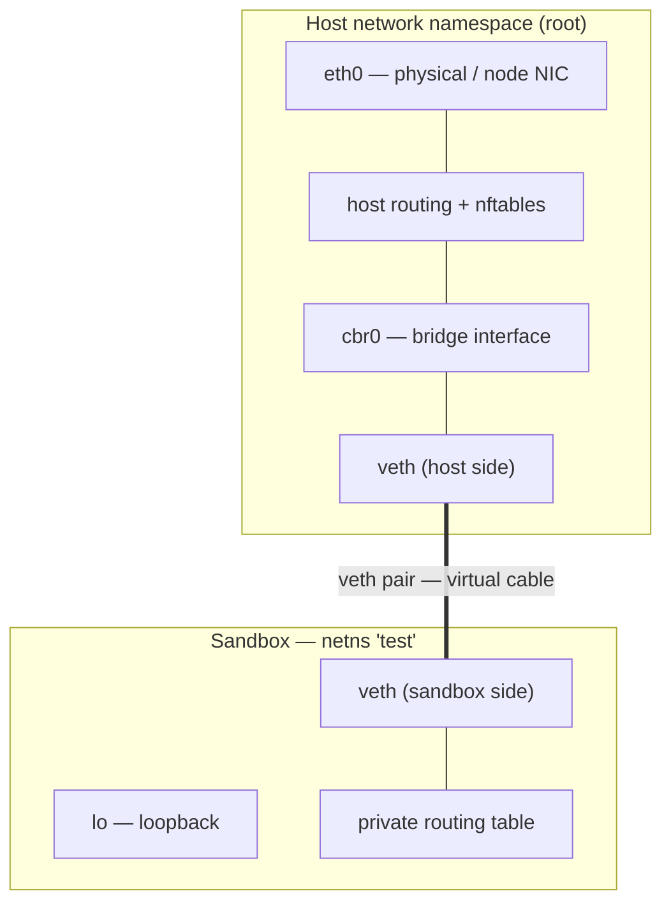

# Linux Network Namespaces — a primer

General Linux knowledge, no Substrate specifics. Written as the prerequisite for
two places in [networking-study-guide.md](networking-study-guide.md):

- **Phase 1, concept 6** — read §1–§3 for the shallow pass. Enough to understand
  what an actor sandbox *is*.
- **Phase 5** (`internal/ateomnet/net.go`) — read all of it, and run the
  experiments, before touching the Go.

Everything here needs a Linux kernel. On macOS, get a shell cheaply:

```bash
docker run --rm -it --privileged ubuntu bash
apt update && apt install -y iproute2
```

`--privileged` is required — namespace manipulation needs `CAP_SYS_ADMIN`.

---

## TL;DR

- **Network namespaces** — a netns is a fully isolated replica of the network
  stack: its own interfaces, routing tables, firewall rules, and socket space.
- **`veth` pairs** — namespaces are isolated by default, so a virtual Ethernet
  pair acts as a two-ended patch cable joining a private namespace back to the
  host.
- **The sandbox boundary** — a fresh namespace is empty: no routes, and only a
  loopback interface that starts `DOWN`. That emptiness *is* the boundary.
- **Why the host namespace is privileged** — it owns the physical NICs, hosts
  the bridges and forwarding rules that let namespaces reach each other, and is
  the only vantage point with the kernel handles to wire new sandboxes up.

---

## 1. What the kernel actually clones

Creating a netns doesn't hide interfaces — it clones an independent stack:

- **Dedicated interfaces.** A namespace sees only devices explicitly assigned to
  it. Physical cards like `eth0` stay in the root namespace unless moved.
- **Independent routing tables.** Own rules, own default gateway. A route added
  in one namespace has zero effect on traffic in another.
- **Isolated firewall & NAT.** `iptables`/`nftables` rules are scoped to the
  namespace. A process inside a sandbox cannot read, alter, or bypass host-level
  firewall policy.
- **Private socket space.** Binding `:8080` inside a namespace never collides
  with `:8080` on the host or in a neighbouring namespace.

---

## 2. The `veth` pair — the virtual cable

A new namespace is cut off entirely, so packets need a conduit:

- **Two-ended tunnel.** A `veth` device is always created as a connected pair;
  what enters one end emerges instantly from the other.
- **Crossing the boundary.** One endpoint stays in the host namespace (often
  attached to a bridge), the other is moved into the target namespace.
- **Ethernet emulation.** Inside the sandbox the `veth` end behaves exactly like
  a physical NIC, with its own MAC address.

---

## 3. The experiment: why a fresh namespace sees nothing

```bash
ip netns add test
ip netns exec test ip addr
```

The output is near-empty because:

- **Zero inheritance.** New namespaces inherit no interfaces, IPs, or gateways
  from the host.
- **Loopback only, and down.** The kernel creates `lo` and nothing else — and
  `lo` starts `DOWN` until you run `ip netns exec test ip link set lo up`.
- **The boundary.** With no external interface and no routing table, a
  compromised process inside `test` cannot scan the node, probe the metadata
  service, or reach the internet. Connectivity is something you *grant*, not
  something you take away.

### 3.1 Wiring it up by hand

Worth doing once — this is the whole of what a CNI plugin does, in six commands:

```bash
ip netns add test
ip link add veth-host type veth peer name veth-ns   # the pair
ip link set veth-ns netns test                       # move one end across
ip addr add 10.200.0.1/24 dev veth-host
ip link set veth-host up
ip netns exec test ip addr add 10.200.0.2/24 dev veth-ns
ip netns exec test ip link set veth-ns up
ip netns exec test ip link set lo up
ip netns exec test ping -c1 10.200.0.1                # crosses the boundary
```

Then delete one end and watch the peer vanish with it — `veth` pairs die
together:

```bash
ip link del veth-host
ip netns exec test ip link      # veth-ns is gone too
```

Cleanup: `ip netns del test`.

---

## 4. Architecture: sandbox and host namespace



A **Linux bridge** is the piece labelled `cbr0` above: a software switch that
forwards packets between interfaces, supporting STP, VLAN filtering, and
multicast snooping. It is the standard way a host fans one uplink out to many
namespaces or VMs.


*(Image hotlinked from developers.redhat.com — won't render offline.)*

> **This is the convention, not the only option.** The bridge layout above is
> what most container runtimes and CNI plugins do. Substrate's actor netns
> deliberately doesn't — see Phase 5 in the study guide.

---

## 5. Why the *host* namespace is privileged

CNI plugins and networking daemons — Flannel, Calico, `kind`'s node routing —
run in the host network namespace (`hostNetwork: true`) for three reasons:

- **Ownership of the hardware.** Only the root namespace holds the physical NICs
  and the kernel drivers that put packets on the wire.
- **The central switchboard.** Isolated namespaces cannot address each other
  directly. The host namespace carries the bridges, IP forwarding tables, and
  NAT rules that connect them.
- **Privilege to wire namespaces.** Creating a `veth` pair, attaching one end to
  a bridge, and injecting the other into a container's namespace requires
  visibility of *both* namespaces. A daemon trapped inside a child namespace has
  neither the handles nor the reach to do it.

---

## 6. Command reference

The Phase 5 prerequisite set, in one place:

| Command | What it answers |
|---|---|
| `ip netns list` | which namespaces exist |
| `ip netns exec <ns> <cmd>` | run anything inside a namespace |
| `ip link` | what interfaces exist, and are they `UP` |
| `ip addr` | what IPs are assigned |
| `ip route` | where does a packet for X go |
| `ip -n <ns> <subcmd>` | shorthand for `ip netns exec <ns> ip <subcmd>` |
| `nft list ruleset` | the whole firewall, all tables |
| `bridge link` | what's attached to which bridge |

Two things that catch people out:

- **`ip netns` only sees *named* namespaces** — those bind-mounted under
  `/var/run/netns`. Container runtimes usually don't name theirs, so a container's
  netns is invisible to `ip netns list`. Reach it via the process instead:
  `nsenter -t <pid> -n ip addr`.
- **A namespace lives as long as something references it** — a process, a bind
  mount, or a file descriptor. Close the last reference and the kernel destroys
  it, taking its interfaces with it.
